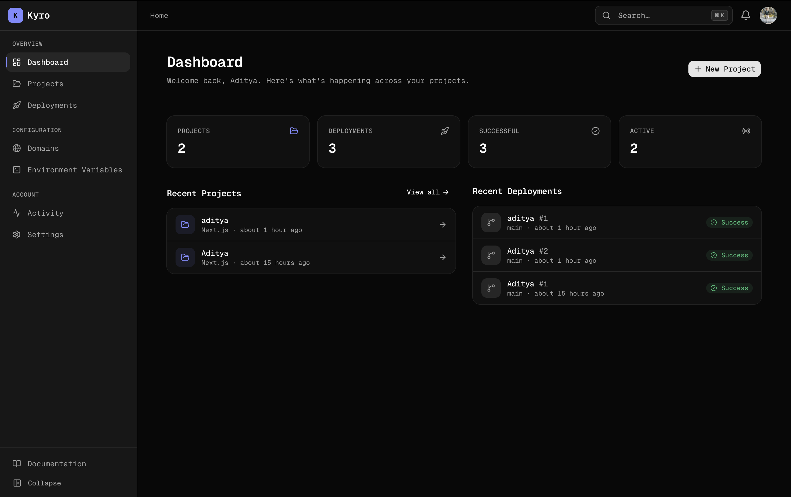

# Kyro Platform

Kyro is a modern, self-hosted Platform as a Service (PaaS) designed to automate deployments, acting as a lightweight Vercel or Netlify alternative. It seamlessly handles both static sites (SPA/SSG) and dynamic Server-Side Rendered (SSR) applications by fetching code, building artifacts, and dynamically routing traffic to the appropriate handlers or static storage.

---

<div align="center">
  
</div>

## 📖 Table of Contents

- [Features](#-features)
- [Architecture Deep-Dive](#-architecture-deep-dive)
- [Project Structure & Microservices](#-project-structure--microservices)
  - [Web App](#1-web-app-kyroweb)
  - [Worker Service](#2-worker-service-kyroworker)
  - [Proxy Service](#3-proxy-service-kyroproxy)
  - [Shared Packages](#4-shared-packages)
- [Tech Stack](#-tech-stack)
- [Getting Started (Local Development)](#-getting-started-local-development)
  - [1. Prerequisites](#1-prerequisites)
  - [2. Clone and Install](#2-clone-and-install)
  - [3. Environment Variables](#3-environment-variables)
  - [4. Start Infrastructure Services](#4-start-infrastructure-services)
  - [5. Run Database Migrations](#5-run-database-migrations)
  - [6. Start the Development Servers](#6-start-the-development-servers)
- [Usage & Accessing Services](#-usage--accessing-services)
- [Contributing](#-contributing)
- [License](#-license)

---

## ✨ Features

- **Git Integration:** Automatically clones and pulls repositories using `simple-git` and `octokit`.
- **Isolated Builds:** Uses Docker to build projects in a sandboxed, consistent environment.
- **Static & Dynamic Hosting:** Intelligently detects if a deployment is static (has `index.html`) or requires Server-Side Rendering (SSR).
- **Custom Domains:** Proxy service dynamically routes requests based on Host headers using database lookups.
- **S3 Compatible Storage:** All build artifacts are securely stored in MinIO.
- **Background Jobs:** Robust queueing system using BullMQ and Redis ensures builds don't block the main API.

---

## 🏗 Architecture Deep-Dive

Kyro relies on a microservices-based monorepo architecture, leveraging BullMQ for task processing, MinIO for artifact storage, and a dynamic reverse proxy for request routing.

<div align="center">
  
</div>

### The Deployment Lifecycle

1. **Trigger:** A user connects their GitHub repository via the Web App and triggers a deployment.
2. **Queueing:** The Web App creates a deployment record in PostgreSQL and pushes a job to the Redis queue via BullMQ.
3. **Processing:** The Worker Service picks up the job. It uses Docker to spin up an ephemeral build container, clones the code, and runs the build command (e.g., `npm run build`).
4. **Storage:** Once built, the artifact files are streamed and uploaded to MinIO storage. The Worker updates the job status to "Completed" in PostgreSQL.
5. **Routing Traffic:** When a visitor hits a Kyro-managed domain, the Proxy Service checks PostgreSQL for the active deployment ID.
   - If static files exist (like `index.html`), it streams them directly from MinIO.
   - If it's a dynamic server (SSR), the Proxy spins up a local Node runner dynamically and proxies traffic to it.

---

## 📂 Project Structure & Microservices

This is a monolithic repository powered by NPM Workspaces, structured into independent apps and reusable packages.

### 1. Web App (`@kyro/web`)

- **Location:** `apps/web/`
- **Role:** The main dashboard and API server built with **Next.js**. It handles user authentication (via Better-Auth), deployment management, GitHub integrations, and real-time status updates via Socket.io.
- **Key Dependencies:** React Query, TailwindCSS, shadcn/ui, Zustand.

### 2. Worker Service (`@kyro/worker`)

- **Location:** `apps/worker/`
- **Role:** A headless Node.js background worker. It continuously listens to the Redis queue using **BullMQ**. When a job arrives, it handles the heavy lifting: cloning repositories, executing Docker build environments, and uploading the finished artifacts.
- **Key Dependencies:** BullMQ, simple-git, ioredis, Pino (for logging).

### 3. Proxy Service (`@kyro/proxy`)

- **Location:** `apps/proxy/`
- **Role:** The edge reverse proxy built with **Express** and `http-proxy`. It listens to incoming web traffic, resolves the requested host, and decides how to serve the deployment. It includes a `RunnerService` that can dynamically start backend Node servers for SSR deployments.
- **Key Dependencies:** Express, http-proxy, MinIO SDK.

### 4. Shared Packages

- **`@kyro/database`:** Located in `packages/database/`. Houses the PostgreSQL schemas, Drizzle ORM client, and migration scripts. Ensures that all microservices use the exact same database types and queries.
- **`@kyro/storage`:** Located in `packages/storage/`. A unified wrapper around MinIO to handle file uploads, downloads, and stream piping across the proxy and worker.
- **`@kyro/shared`:** Located in `packages/shared/`. Contains shared TypeScript interfaces, constants, and utilities used universally across the monorepo.

---

## 🛠 Tech Stack

- **Frontend & Core API:** Next.js (App Router), React, TailwindCSS, shadcn/ui, Better-Auth
- **Background Worker:** Node.js, BullMQ, simple-git, Docker (for isolated builds)
- **Routing Proxy:** Express, http-proxy
- **Database & Cache:** PostgreSQL, Drizzle ORM, Redis (ioredis)
- **Storage:** MinIO (S3-compatible Object Storage)
- **Monorepo Management:** NPM Workspaces, mprocs

---

## 🚀 Getting Started (Local Development)

Follow these step-by-step instructions to get the complete Kyro architecture running locally.

### 1. Prerequisites

- **Node.js** (v20+)
- **NPM** (v9+)
- **Docker** & **Docker Compose** (must be running on your machine)
- **mprocs** (recommended for managing multiple dev servers)

### 2. Clone and Install

Begin by cloning the repository and installing dependencies at the root. NPM Workspaces will automatically bootstrap all apps and packages.

```bash
git clone <your-repo-url>
cd kyro
npm install
```

### 3. Environment Variables

Copy the example environment file to the root level.

```bash
cp .env.example .env
```

Open `.env` and fill out the necessary values:

- **Database:** PostgreSQL connection string (`DATABASE_URL`).
- **Redis:** Redis connection URL (`REDIS_URL`).
- **MinIO:** Access keys, secret keys, and endpoint config.
- **GitHub Apps / Auth:** Client IDs and secrets for OAuth.

### 4. Start Infrastructure Services

Kyro relies on PostgreSQL, Redis, and MinIO. Start them quickly using the provided Docker Compose file:

```bash
docker compose -f docker-compose.dev.yml up -d
```

_(Wait 10-15 seconds for the services to fully initialize)._

### 5. Run Database Migrations

Before starting the apps, generate and push the database schema to your local PostgreSQL instance:

```bash
cd packages/database
npm run db:push
# Return to the root folder once completed
cd ../..
```

### 6. Start the Development Servers

We use `mprocs` to run all microservices concurrently in a beautiful unified terminal UI.
From the root directory, simply run:

```bash
npm run dev
```

This single command spins up:

- The **Next.js Web App** (Frontend & API)
- The **Background Worker Service**
- The **Express Proxy Service**

---

## 🧭 Usage & Accessing Services

Once everything is running, you can access the platform at:

- **Main Developer Dashboard:** [http://localhost:3000](http://localhost:3000)
- **Proxy/Routing Engine:** [http://localhost:8000](http://localhost:8000) (Your deployed apps will be served here)
- **MinIO Console (Storage):** [http://localhost:9001](http://localhost:9001) (Check `.env` for default login credentials, e.g., `kyro_admin` / `kyro_password`)

---
